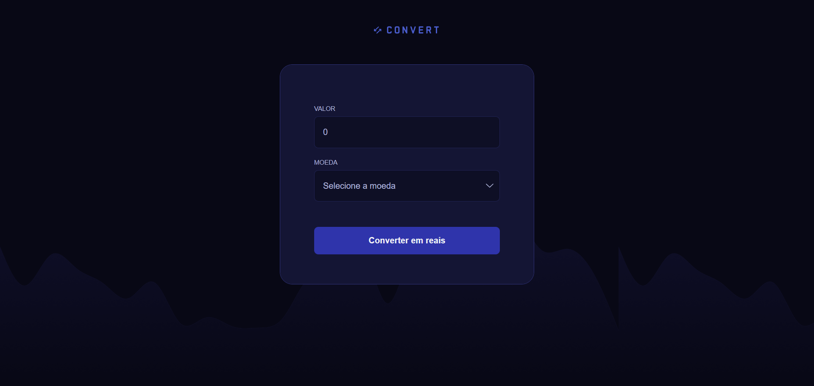

# Conversor de Moedas

Projeto desenvolvido com HTML, CSS e JavaScript para converter moedas em Real Brasileiro (BRL).

🔗 Deploy: [ferlimatos.github.io/conversor-de-moedas/](https://ferlimatos.github.io/conversor-de-moedas/)

## Melhorias aplicadas

- Correção do layout do footer ao exibir o resultado
- Responsividade para dispositivos móveis
- Suporte para valores decimais com vírgula e ponto
- Adição do iene japonês ao conversor

## Funcionalidades

- Conversão de moedas
- Validação de input
- Formatação em Real Brasileiro
- Responsividade
- Manipulação de DOM com JavaScript

## Tecnologias

- HTML5
- CSS3
- JavaScript

## Conceitos praticados

- Eventos
- Funções
- Condicionais
- Regex
- Manipulação de classes CSS
- Formatação de moedas com `toLocaleString()`
